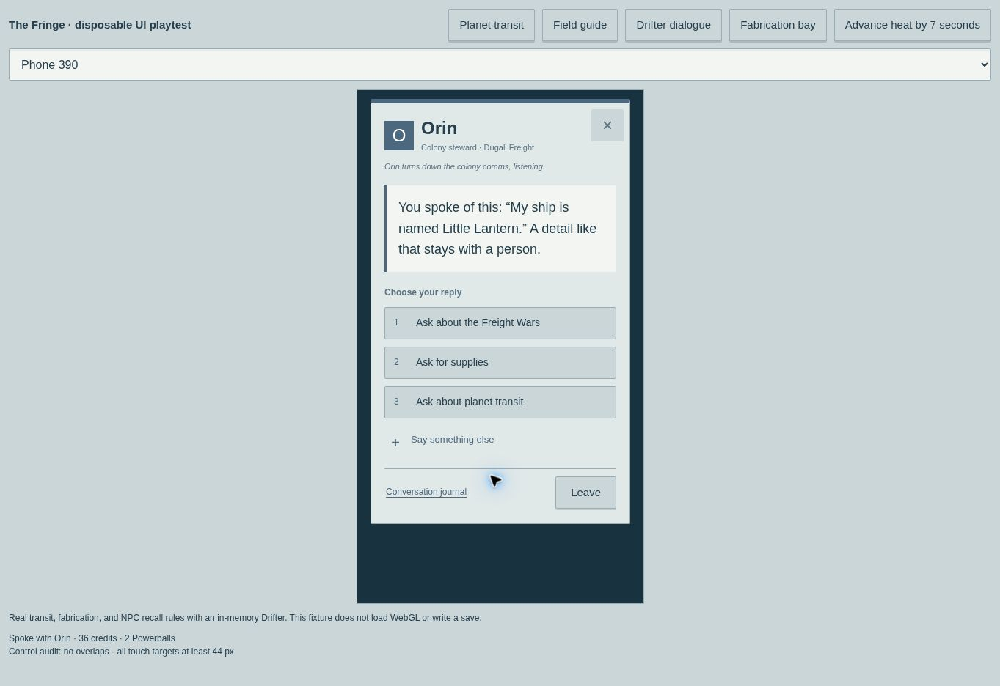

# The Fringe · Drifter

A browser survival and exploration game set on remote, procedurally generated planetary surfaces colonized by Drifters. Play at https://joramvanloenen.github.io/persistent-dungeon/.

## The frontier

The setting follows the supplied Fringe history: unincorporated systems beyond Beshtala-Chanko's public transit routes, the Powerball boom, Round Power Corporation, Dugall Freight, Man Earlie's fragmented army, the Freight Wars and Feigngull Massacre, and Klem Earlie's decision to end the attacks. A field guide preserves these subjects in eight readable chapters. Drifters can explain them in conversation while retaining the exact information players tell them. Drifter colony life and the game's planetary destinations are additions to that setting.

## Play

- Start at your own landing pod in a randomly assigned Drifter colony. Each player receives a separate home plot; every new session returns you to that pod.
- Explore nine planetary survey regions, each roughly 16 km across, with seeded hills, valleys, six biomes, rivers, lakes, service tracks, and colonies. These regions reuse the original world coordinate space to preserve existing identifiers and saves. Transit changes your active planetary surface; walking cannot cross its survey boundary. This version does not simulate spaceflight.
- Open **Map → Planet transit**, settings, or press **G** near a colony or your pod. Unvisited planets appear as unknown colony beacons. Your first Dugall trip uses an arrival voucher; later trips cost four credits or one Powerball. Landing reveals the destination's name and adds it to saved discoveries.
- Recover biomass, silicate, nutrient pods, biofilament, and alloy fragments. Some mineral deposits contain visible glowing Powerballs. A fabricator can refine one from two silicate and one alloy fragment, or buy one for twelve credits. Use recyclers or filtered river water, and rest in colonies or at your pod.
- Investigate decommissioned facilities, freight bunkers, and research annexes. Connected rooms and corridors contain cargo and security automatons. Entrance icons separately track exploration and recovered supplies. Collected resources and defeated security remain saved.
- Meet scavengers, colony stewards, freight runners, and fabricators with independent Drifter, Round Power, or Dugall affiliations. Conversation shows the current RPG line; past exchanges are available only through **Conversation journal**.

## Movement, equipment, and fabrication

Click/tap ground to walk, or use WASD/arrows. Hold **Shift** to run, **Space** to jump, **F** to attack with an equipped weapon, **E** to interact, **I** for cargo, and **M** for the surface map. Drag to orbit horizontally and vertically; scroll/pinch to zoom. Camera elevation is bounded, and the minimap follows camera forward. Mobile has separated Run, Jump, and Attack controls and dialog layouts that adapt to the keyboard.

Most colonies have an induction fabrication bay. Approach its fabricator for the weapon catalog: **Vibroknife** (10 strikes), **Arc blade** (14), or **Breacher axe** (16). Pay the bay rental and materials once, heat an alloy blank for 6–9 seconds until orange, then transfer it to the forming press. Overheating ruins the blank. Hit each highlighted press square within two seconds; three mistakes require reheating. Replacement blanks are included in the rental. Completed equipment and unfinished jobs persist. Cancel a remote job from Planet transit if a session return leaves you away from its bay; its paid fee and materials are consumed. Calibration rigs let you practice; defeated security units yield credits and alloy.

Habitat pods, modular housing, freight shuttles, recyclers, fabrication equipment, access locks, rocks, and alien plant trunks have collision footprints. Running uses swept movement; click navigation routes around obstacles. Branching vegetation is generated from tapered stems, dangling lianes, knobs, and seed pods, with eleven instanced families and biome colors. Canopy structures range from coiled tendrils to giant sail umbrellas; ground cover includes shard rosettes, tube coral, spore buttons, nutrient nests, and ribbon reeds. Near models use 102–224 triangles for canopy plants and 12–52 for ground cover; distant models use 6–122. Plant sizes vary deterministically by family and location. Ground cover remains soft.

## Persistence status and compatibility

The public Pages build is a **local preview until a backend is configured**. It saves in the browser and supports export/import. GitHub Pages cannot run a database. [Backend setup](backend/README.md) explains how to enable account saves across devices, globally depleted resources, other players, and shared NPC memories through Supabase or Node/SQLite.

NPC replies use deterministic authored dialogue and memory matching, not an LLM. Every successful message is stored verbatim and can be recalled, including information from other players in a configured shared world. Building is not implemented yet.

The genre conversion preserves the original seed, resource/NPC/home/facility IDs, inventory keys, account storage, save format, and weapon IDs/stats. Original equipment receives sci-fi names; cargo, pod ownership, conversations, exploration, and paid jobs survive. Credits retain the internal `coins` field and Powerballs add `inventory.powerballs`. New fields include `planet`, `visitedPlanets`, `arrivalVoucher`, and `landing`. No save reset is needed.

## Run and test

Serve the root with `python3 -m http.server 8080`, then open http://localhost:8080. No build or package installation is needed. Run `npm test` (Node 22.13+ for SQLite tests).

The 39 tests cover generation, migration, local and server reloads, shared resource claims and stale revisions, exact NPC recall, connected facilities, camera/minimap behavior, collisions, foliage, combat, fabrication timing, transit fares and restrictions, all nine safe landing points, and saved planetary discoveries.

`dev/fringe-preview.html` is a disposable UI playtest using the real transit, fabrication, and conversation rules in memory. It includes desktop and 320/390 px phone layouts and a visible control audit. It does not load WebGL or change a traveler save. Other `dev/` previews exercise dialogue layout, camera-oriented minimaps, and fabrication timing.

## Architecture

- `src/world.js`: stable seeded terrain, resources, colonies, and NPCs.
- `src/planets.js`, `src/fringe-lore.js`: survey destinations, validated transit, and canonical history.
- `src/rules.js`, `src/action-game.js`: shared validated state changes and recall.
- `src/render.js`, `src/dungeon-render.js`: Three.js surface streaming and industrial facilities.
- `src/scene-layout.js`, `src/world-collision.js`: shared obstacle placement and swept movement.
- `src/alien-vegetation.js`: generated branching vegetation and instanced chunk meshes.
- `dev/alien-vegetation-preview.html`: geometry catalogue with biome, LOD and triangle counts.
- `src/main.js`, `src/map.js`, `src/forge-ui.js`, `src/fringe-ui.js`: controls, survey, fabrication, transit, and archive UI.
- `src/storage.js`: local preview or configured backend adapter.
- `backend/server.mjs`: Node/SQLite accounts and durable state.
- `backend/schema.sql`, `supabase/functions/world/index.ts`: transactional Supabase backend.

Permanent mechanics should use validated actions, atomic state updates, and append-only events. Preserve the seed and identifiers when adding construction or new planetary systems. Three.js and the optional Supabase client are bundled locally under their licenses. Pages publishes the root of `main` with relative asset paths and `.nojekyll`.

## Reclaimed shelter models

Colony buildings and the owned pod are assembled from recovered rocket stages and freight hardware. Three deterministic silhouettes use horizontal booster hulls, upright escape stages, or crashed cargo capsules. Each has a welded front pressure lock, exposed electronic cabinets and power cables, solar salvage, and an antenna. The personal pod adds a spent auxiliary booster. Smaller components switch off at a distance so phone rendering stays responsive. All houses retain the same plots and collision footprints; old saved homes and doors remain in place. `dev/salvage-preview.html` projects the actual mesh geometry for inspecting these parts without WebGL.
