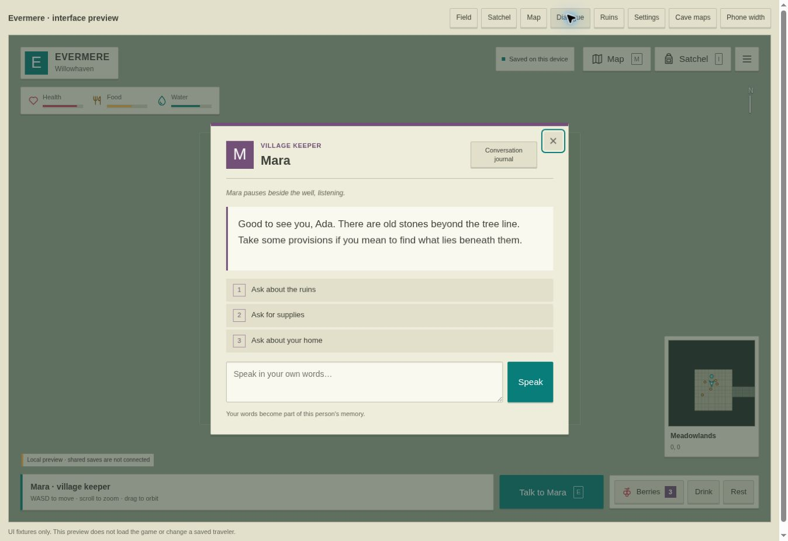
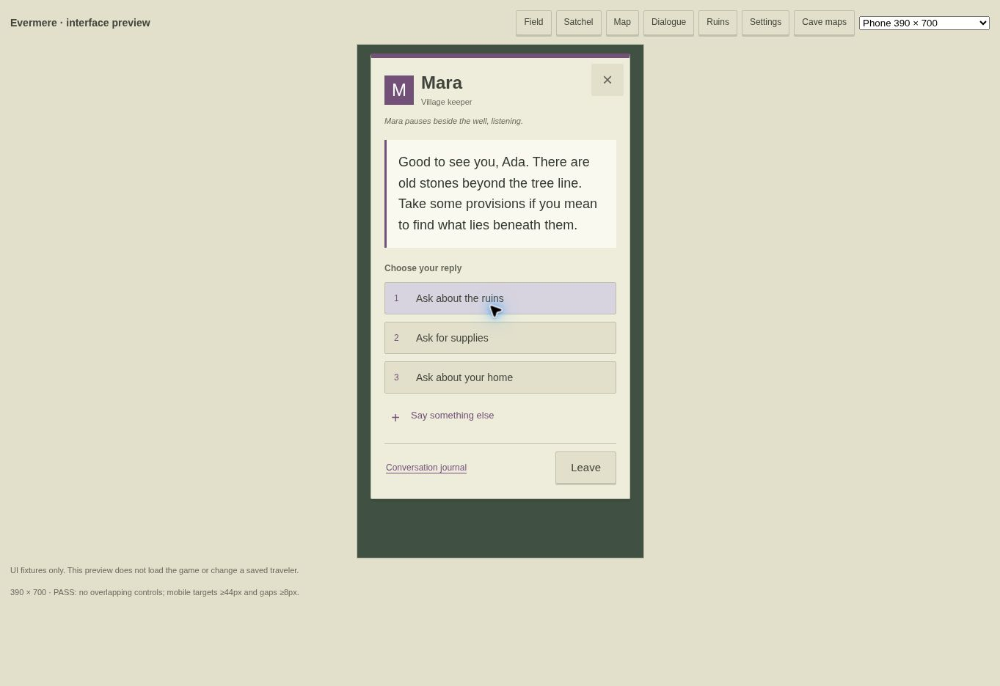

# Persistent Dungeon · Evermere

A browser survival/exploration game with a streamed, procedural 3D medieval wilderness.

**Play:** https://joramvanloenen.github.io/persistent-dungeon/

## First version

- 65.4 × 65.4 km seeded terrain, hills and valleys, six biomes, rivers and lake basins.
- Thousands of deterministic settlements connected by roads and timber bridges.
- Random village spawn, click/tap movement, WASD, movable camera, minimap and waypoint atlas.
- Wood, stone, berries, fiber, inventory, relaxed hunger/thirst, wells and village rest.
- Stable NPC identities, full saved conversations, searchable memory and information shared between travelers.
- Persistent event log and authoritative resource claims/revision checks when connected to the backend.
- Mobile support and a lower rendering quality option.

## Important: persistence status

The default Pages build is a **local preview** until a backend is configured. It saves in the browser, offers export/import, and clearly shows that shared saves are not connected. GitHub Pages cannot run a database.

The complete Supabase backend and alternative Node/SQLite server are included. Follow [backend setup](backend/README.md) to enable account saves across devices, shared resource depletion, other travelers, and shared NPC memories. All live player data remain in that database, not this repository.

NPC replies currently use a transparent, deterministic memory and keyword system. Every successful message is stored verbatim; replies can recall it. This version does not call an LLM. Building and combat are not implemented yet.

## Run and test

Serve the root folder with any static server, e.g. `python3 -m http.server 8080`, then open `http://localhost:8080`. No installation/build is needed. JavaScript modules must be served over HTTP.

`node --test tests/*.test.mjs` runs generation, action validation, persistence, concurrency, and archived NPC recall checks. Node 22.13+ is needed for the SQLite backend.

## Architecture

- `src/world.js`: immutable seed, versioned generation, settlement/resource/NPC IDs.
- `src/render.js`: Three.js chunk streaming, terrain, water, bridges, settlements, vegetation and camera.
- `src/rules.js`: shared gameplay validation and NPC recall.
- `src/storage.js`: local preview, Supabase Edge Function, or self-hosted server adapter.
- `src/main.js`, `src/map.js`: game UI and maps.
- `backend/schema.sql`, `supabase/functions/world/index.ts`: transactional production backend.
- `backend/server.mjs`: self-hosted SQLite alternative with accounts.

New permanent mechanics should add validated actions, atomic state changes, and append-only events. Preserve existing seed and identifiers. Building can add an indexed world-structures table and a `build` action without replacing player saves.

Three.js is bundled locally under its MIT license. Supabase client is bundled for the optional cloud connection.

GitHub Pages is configured to publish the root of `main`; the root `index.html` and relative asset paths support the repository subpath. `.nojekyll` keeps module files unmodified. No deployment workflow is required.

## Expansion: homes, ruins, and dungeons

Every player now receives a new, individually owned cottage on a vacant village plot. Existing saves gain a home while preserving supplies and all NPC conversations. Every page load/sign-in starts the traveler at their own doorstep; leaving a dungeon during the session returns to its entrance. Dungeon exploration and collected supplies remain saved even when the traveler returns home.

Ancient ruins appear near settlements and on the atlas as diamonds. Approach an arch to choose whether to enter. The cave marker shows two separate states: hollow/filled diamond for unexplored/entered (check when all chambers are visited), and a supply mark (check when all deposits have been gathered). Dungeons contain 9–12 connected chambers, branching corridors, mineral deposits, timber, cloth, dried provisions, and stairs back to the surface. Click movement finds a walkable path through corridors. The dungeon atlas shows the connected floor plan, with unexplored chambers dimmed and explored chambers highlighted. The underground minimap follows the traveler at a closer scale.

NPC conversation now shows only the current RPG dialogue line and topic choices. Past exchanges are available only through **Conversation journal**, with earlier pages available on demand. Replies still use persistent memory and authored dialogue rules rather than an LLM.

The expansion adds biome-specific broadleaf trees and conifers, bushes, grass, flowers, reeds, personal gardens, denser scenery, correct backpack orientation, and less distant fog when zooming out.

For an already configured Supabase backend, run the new `Expansion v2` section at the end of `backend/schema.sql` and redeploy the `world` function. For the SQLite backend, restart the updated server; it adds the new homes and resource-space schema without removing existing data. The public Pages build remains a local preview until that shared backend is connected.

## Interface and camera update

The UI uses flat cream panels, square controls, consistent line icons, teal actions, and coral/plum status accents. Drag horizontally to orbit and vertically to change elevation. Elevation stays between 18° and 70° above the horizon (32°–70° underground). The camera interpolates angles around the traveler rather than crossing through the orbit center. World labels use the current camera matrix on every frame.

Surface minimaps scroll using cached terrain; the marker stays centered as the traveler walks. Dungeon lighting and fog are adjusted for the closer camera. Regression tests exercise the full dungeon scene transition, rendered-floor connectivity, extreme camera input, minimap scrolling, and save preservation.

Minimaps also rotate with the camera's smoothed yaw, including when turning in place. Camera forward is always at the top; the north marker travels around the edge and the player arrow shows facing relative to the camera. The surface terrain cache includes the diagonal crop needed for rotation, and dungeon floors use the same orientation. `dev/minimap-preview.html` compares north-up references with camera views without changing saves.

`dev/ui-preview.html` provides desktop and phone UI fixtures without loading WebGL or touching a traveler save. This is a development preview, not a gameplay session.

## Mobile dialogue and controls

Phone controls have at least 44 × 44 px touch targets and 8 px between adjacent controls. The action dock stacks into separate rows, with the minimap and notices following its actual height. Dialogs follow the visible viewport when the keyboard opens, and the field HUD is hidden while a dialog is active.

NPC speech is the main visual focus, followed by clearly grouped reply choices. **Say something else** expands the custom reply form only when needed; **Conversation journal** remains a secondary action in the footer. Existing conversation memories and saves are unchanged.

The development preview includes 320, 360, 390, and 430 px phone layouts, a keyboard-sized viewport, and a live overlap/touch-target audit. Layout checks and all 17 automated regression tests pass.

## Action and the town forge

Hold **Shift** to run, press **Space** to jump, and **F** to swing an equipped weapon. Touch screens have Run, Jump, and Attack buttons. Running and jumping use regenerating stamina; running distance, jumps, and attacks are recorded. Jumping can evade a sentinel's counterattack. Village practice dummies let you try a new weapon; dungeon stone sentinels drop coins and iron ore when defeated. Defeated sentinels remain defeated for that traveler. If overwhelmed, the traveler wakes at home with their supplies.

Most towns have a smith and a visible furnace/anvil. The atlas marks those towns with a hammer. Approach the smith to open the crafting catalog: iron dagger (10 strikes), short sword (14), and iron axe (16). New and existing travelers receive 24 starting coins once. Gather stone/mineral deposits for iron ore, buy material bundles, or sell spare wood, stone, and fiber to the smith.

Each job consumes the displayed coin fee, ore, and wood. Heat the billet for 6–9 seconds until it glows orange, then transfer it to the anvil. Overheating makes it spark, fizzle, and break apart. Strike the highlighted square within 2 seconds; a missed or wrong strike loses progress, and three misses require heating again. Replacement billets are included in the paid session. Completed weapons are saved and equipped automatically; the satchel can switch equipment. Paid jobs and their timing also survive reloads. Abandoning consumes the paid fee and materials.

The action rules run in local, Node/SQLite, and Supabase modes. Configured servers need the updated source; Supabase also needs the updated `apply_game_action` function from `backend/schema.sql` for its gameplay rate limit. No new tables are needed. The public Pages version retains its existing local-preview save mode until a shared backend is configured.

`dev/forge-preview.html` is a disposable UI playtest using the real crafting rules, with a heating-time advance button. It never writes a traveler save. Automated checks cover save migration, forging windows and penalties, duplicate completion, combat reach/cooldowns, jump physics, rendered equipment, and local/server reload persistence.
