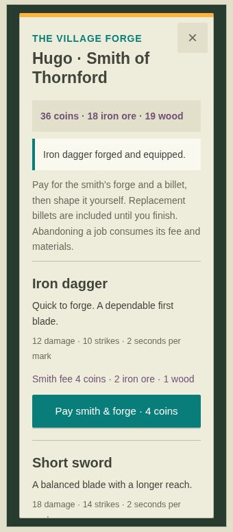

# Action and forge verification — 2026-09-30

- 25 automated tests passed: paid forge validation, heat deadlines, strike patterns, stale requests, weapon ownership, combat rewards, stamina, jump bounds, persisted state, and backend restart recovery.
- Production Forge UI browser fixture: paid 4 coins, heated an iron dagger billet, completed 10 timed strikes, and equipped the resulting dagger. The fixture uses an in-memory traveler and changes no real saves.
- Mobile HUD audit passed at 320 × 568 and 390 × 700: no intersecting controls, at least 44 px touch targets, at least 8 px gaps.
- GitHub Pages deployment of gameplay commit 5654bf3f0e54694b9dbe954223ec260356a74b4e succeeded.
- The cloud browser cannot create a WebGL context; movement and combat visual behavior were checked with the automated Three.js scene fixtures, rather than a full rendered browser playthrough.

